# 远远的天空 · Sky Blog

> 一个以「天空四时刻」——黎明、正午、黄昏、星夜——为视觉主线的个人博客系统。
> 前台一页式沉浸漫游，后台温暖文艺风管理面板；Express + SQLite 后端，零外部依赖部署。


---

## 目录

- [特性](#特性)
- [截图预览](#截图预览)
- [技术栈](#技术栈)
- [快速开始](#快速开始)
- [项目结构](#项目结构)
- [设计系统](#设计系统)
- [API 一览](#api-一览)
- [数据模式](#数据模式)
- [部署](#部署)
- [开发约定](#开发约定)
- [文档](#文档)

---

## 特性

### 前台 · 天空漫游

- **一页式四段叙事**：黎明（天空轮播）→ 正午（云海文章卡片）→ 黄昏（分类地层 + 时间河）→ 星夜（签名 + 搜索 + 登录入口）
- **天空轮播**：全屏背景图 Ken Burns 缓推动效 + 淡入切换，「时刻」文案同步轮播
- **散落拼贴卡片**：最新 5 篇文章以微旋转、边缘叠放、悬停聚焦的拼贴方式呈现（参考杂志版式）
- **分类地层**：7 个分类以彩色书页层叠排列，hover 上浮展开
- **时间河**：按月份统计文章数量，竖向时间轴可视化发布节奏
- **文章详情**：阅读进度条、沉浸式封面、富排版正文、作者卡片、上下篇导航
- **文章列表**：支持按分类 / 标签 / 月份 / 关键词筛选
- **Markdown 渲染**：自研轻量渲染器 `md.js`，支持标题、引用、代码、图片、表格、列表
- **响应式**：桌面 / 平板 / 手机三档适配

### 后台 · 温暖文艺管理面板

- **仪表盘**：已发布 / 草稿 / 分类 / 轮播 KPI 卡片 + 快捷操作 + 最近草稿
- **文章管理**：搜索 / 状态 / 分类筛选 + 批量发布/草稿/删除 + 封面缩略图 + 行内编辑/预览/切换状态
- **分类管理**：新增 / 编辑表单 + 天空色板（s1-s7 对应首页地层色）+ 文章数统计
- **轮播管理**：卡片式编辑 + 图片预览 + 关联文章 + 启用开关 + 排序
- **站点配置**：站点名 / 作者 / 社交链接 / 页脚分区 + 头像实时预览
- **Markdown 编辑器**：EasyMDE（CodeMirror 内核），工具栏 + 分屏预览 + 全屏 + Ctrl+S 保存
- **温暖设计系统**：暖赭/陶土色板、衬线标题、Lucide 图标，全本地化（无 CDN 依赖）

### 工程化

- **前后端一体**：Express 静态服务 + RESTful API，单进程部署
- **SQLite 持久化**：WAL 模式，零配置；`SEED=1` 自动播种 17 篇示例文章
- **双数据模式**：默认走后端 SQLite，`?mode=local` 切换 localStorage 纯前端模式
- **契约驱动**：`docs/契约.md` 为单一事实来源，前端变量名 = API JSON key = 数据库列名
- **链接校验**：`npm run check-links` 扫描全部内部链接，94/94 通过

---

## 截图预览

### 前台

| 黎明·天空轮播 | 正午·云海卡片 |
|---|---|
|  |  |

| 黄昏·分类地层 | 星夜·签名 |
|---|---|
| 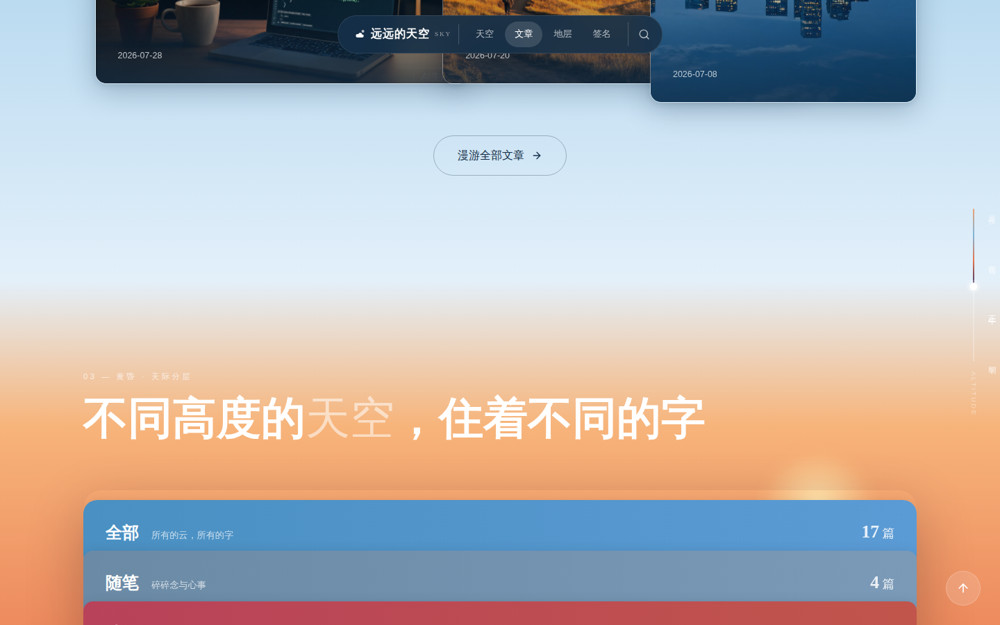 | 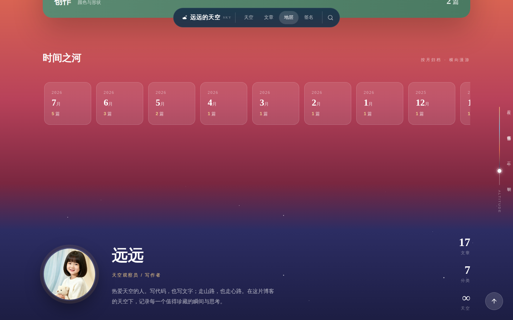 |

| 文章列表 | 文章详情 |
|---|---|
| 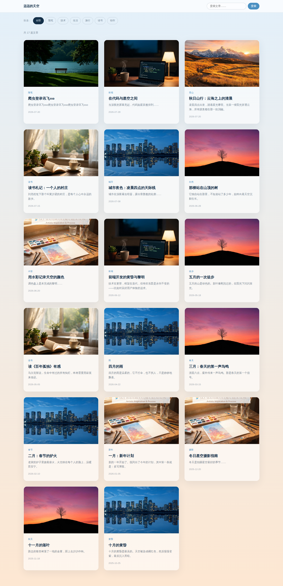 | 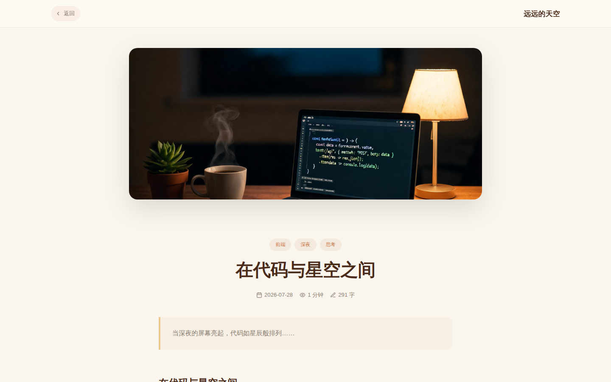 |

### 后台

| 登录 | 仪表盘 |
|---|---|
| 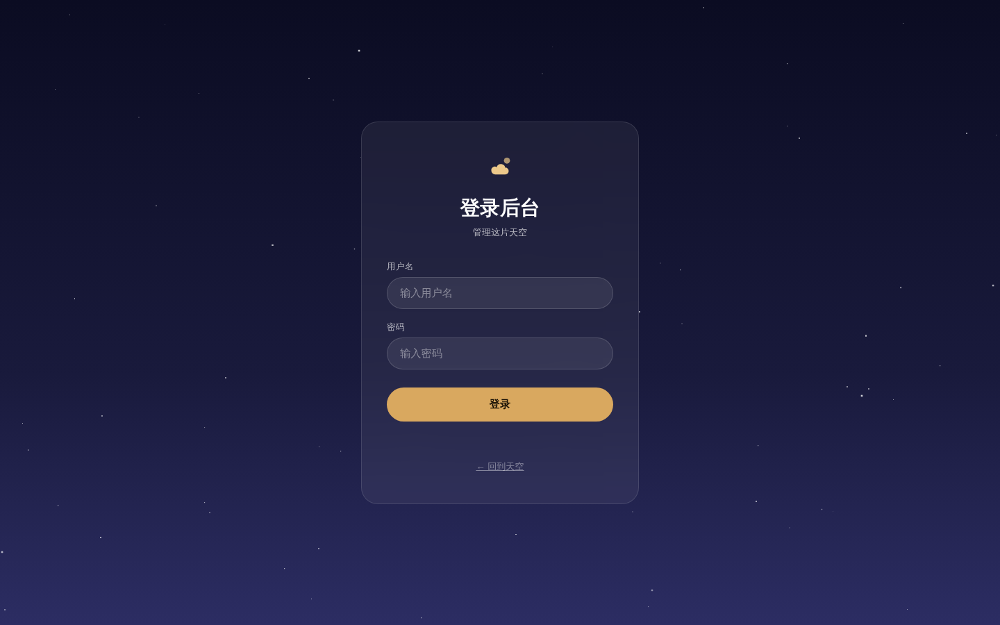 | 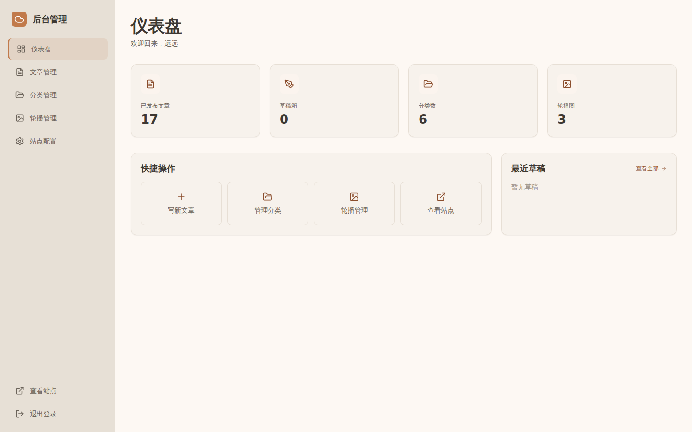 |

| 文章管理 | 分类管理 |
|---|---|
| 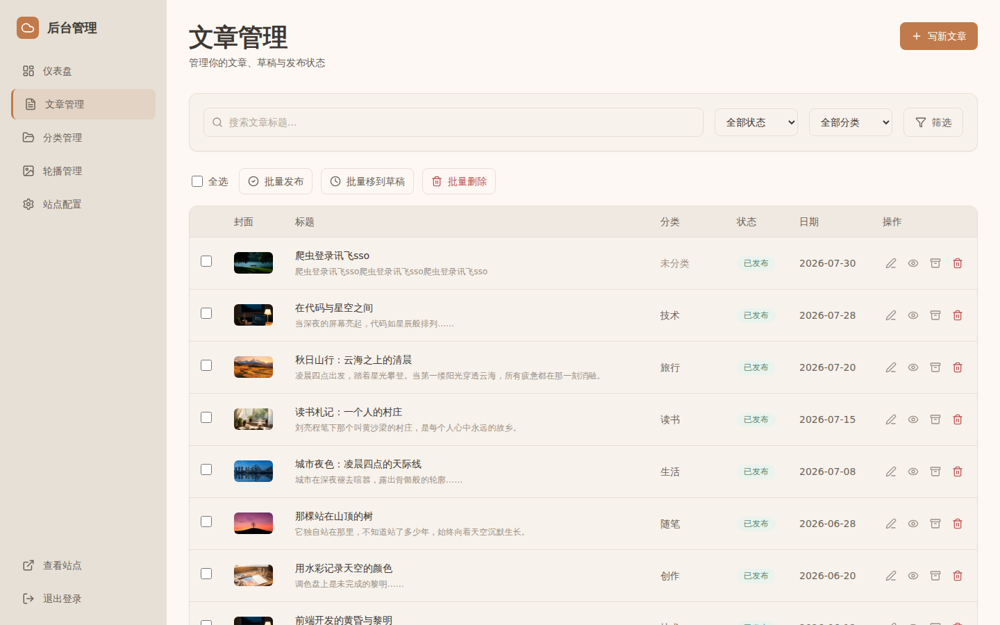 | 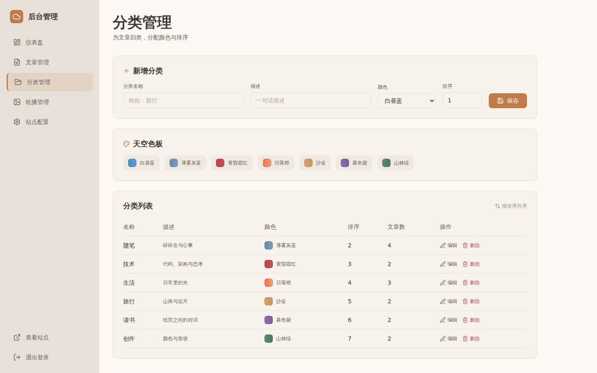 |

| 轮播管理 | 站点配置 |
|---|---|
| 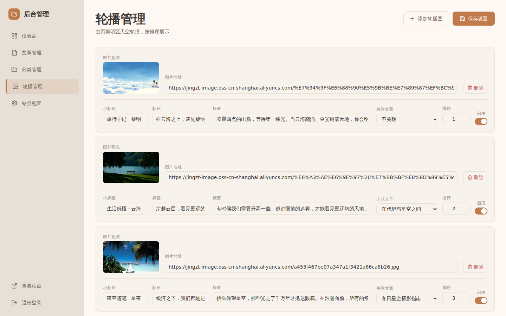 | 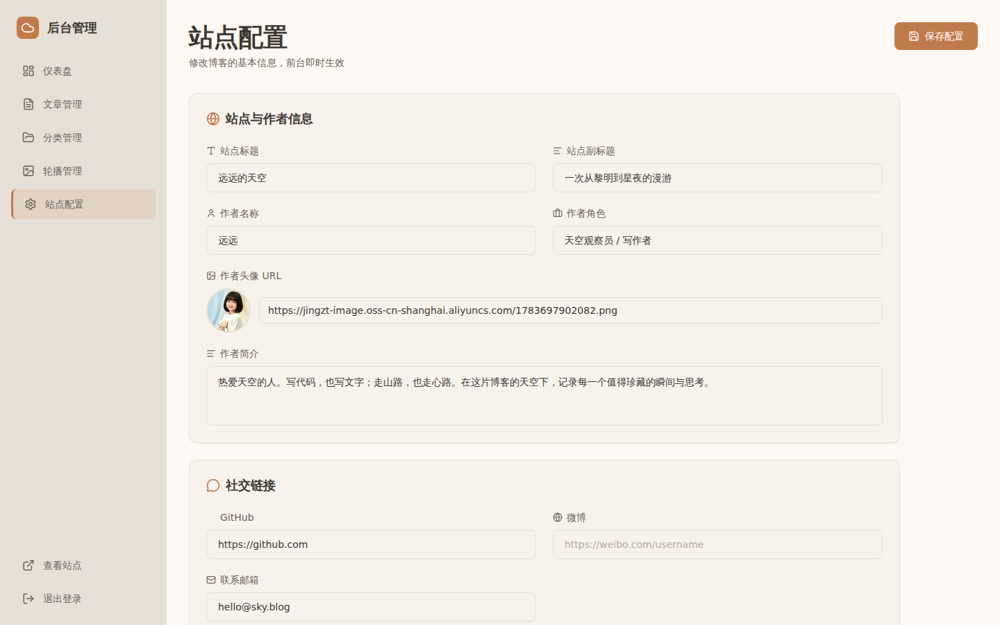 |

| Markdown 编辑器 |
|---|
| 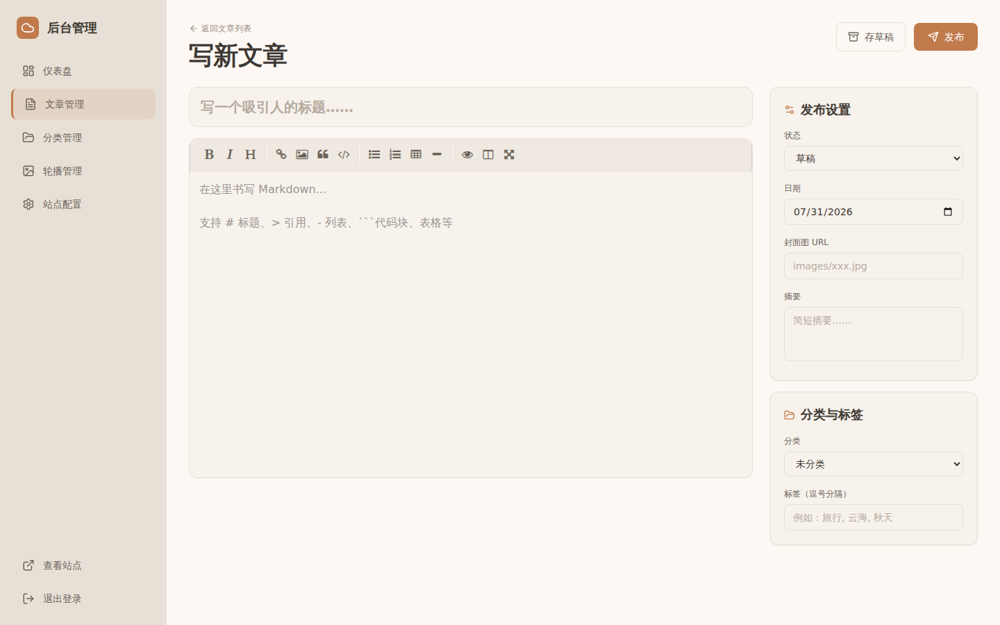 |

---

## 技术栈

| 层 | 选型 | 说明 |
|---|---|---|
| 前端 | 原生 HTML + CSS + JS | 无构建步骤，开箱即用 |
| 样式 | CSS Custom Properties | 设计令牌全量变量化 |
| 后台 UI | Tailwind v4 (browser) + Lucide | 已本地化到 `public/js/vendor/` |
| 编辑器 | EasyMDE + CodeMirror | 成熟开源 Markdown 编辑器 |
| 后端 | Express 4 | 静态服务 + RESTful API |
| 数据库 | better-sqlite3 (SQLite) | WAL 模式，单文件 `data/app.db` |
| 鉴权 | 内存 Token | 简单可靠，适合单用户 |
| 字体 | 思源宋体 / Fira Code | 衬线正文 + 等宽代码 |

---

## 快速开始

### 环境要求

- Node.js ≥ 18
- npm

### 安装与运行

```bash
# 克隆
git clone git@github.com:jingzty/sky-blog.git
cd sky-blog

# 安装依赖
npm install

# 首次运行（带种子数据，17 篇文章 + 7 分类 + 3 轮播）
SEED=1 PORT=8321 npm start

# 后续运行（数据已持久化）
PORT=8321 npm start
```

打开 `http://localhost:8321/index.html` 即可访问。

### 访问后台

- 登录页：`http://localhost:8321/login.html`
- 默认账号：`admin` / `admin`（可通过环境变量 `ADMIN_USER` / `ADMIN_PASS` 修改）
- 后台首页：`http://localhost:8321/admin/index.html`

### 常用命令

```bash
npm run check-links   # 校验全部内部链接
npm run seed          # 重新播种示例数据（仅在数据库为空时生效）
npm run test:e2e      # 端到端测试
```

---

## 项目结构

```
sky-blog/
├── server.js                # Express 服务 + API + 静态托管
├── package.json
├── migrations/
│   └── 001_init.sql         # 建表 SQL（启动时自动执行）
├── data/
│   └── app.db               # SQLite 数据库（gitignore，运行时生成）
├── docs/                    # 设计文档（契约驱动）
│   ├── 定界.md              # 阶段 0：范围界定
│   ├── 契约.md              # 阶段 1：单一事实来源
│   └── 交互点清单.md        # 51 个交互点
├── scripts/
│   ├── check-links.js       # 链接校验
│   ├── migrate-from-localstorage.js
│   └── e2e.js               # 端到端测试
└── public/                  # 前端静态资源
    ├── index.html           # 首页（四段天空叙事）
    ├── post.html            # 文章详情
    ├── posts.html           # 文章列表
    ├── login.html           # 登录
    ├── 404.html             # 兜底页
    ├── admin/
    │   ├── index.html       # 仪表盘
    │   ├── posts.html       # 文章管理
    │   ├── categories.html  # 分类管理
    │   ├── slides.html      # 轮播管理
    │   ├── config.html      # 站点配置
    │   └── editor.html      # Markdown 编辑器
    ├── css/
    │   ├── tokens.css       # 设计令牌（天空色系）
    │   └── admin.css        # 后台温暖设计系统
    ├── js/
    │   ├── api.js           # 数据访问层（local/remote 双模式）
    │   ├── md.js            # Markdown 渲染器
    │   ├── ui.js            # 共享 UI 工具
    │   ├── admin.js         # 后台共享侧栏 + toast
    │   ├── easymde.*        # EasyMDE 编辑器（本地化）
    │   ├── codemirror.*     # CodeMirror（本地化）
    │   └── vendor/          # Tailwind v4 + Lucide（本地化）
    └── images/              # 文章封面 + 轮播图 + 头像
```

---

## 设计系统

### 天空四色系

首页以一天的四段天空为视觉主线，每段有独立的色系渐变：

| 时刻 | 最浅 → 最深 | 墨色（文字） |
|---|---|---|
| 黎明 | `#fde7d2` → `#c9764a` | `#4a2a18` |
| 正午 | `#e3f0fa` → `#4a90c2` | `#143049` |
| 黄昏 | `#f7b47a` → `#7a2740` | `#2e1018` |
| 星夜 | `#2c2d63` → `#05060f` | `#ece8f4` |

辅助色：金色 `--gold #d9a85f`（点缀）、奶油 `--cream #faf6ee`（底色）。

完整令牌见 [`public/css/tokens.css`](public/css/tokens.css) 与 [`docs/契约.md`](docs/契约.md) 契约 A。

### 后台温暖色板

后台采用独立的「温暖文艺」设计系统（暖赭 / 陶土色系），与前台的天空冷调形成对比：

- 主色 `--warm-brand: #c17a4b`（陶土橙）
- 背景 `--warm-bg: #fdf8f3`（暖米色）
- 衬线标题 + 圆角卡片 + Lucide 线性图标

完整令牌见 [`public/css/admin.css`](public/css/admin.css)。

---

## API 一览

所有 API 前缀 `/api`，JSON 交互。完整定义见 [`docs/契约.md`](docs/契约.md) 契约 C。

| 模块 | 方法 | 路径 | 鉴权 | 说明 |
|---|---|---|---|---|
| 认证 | POST | `/api/login` | — | 返回 token |
| 认证 | GET | `/api/check` | ✅ | 验证 token |
| 文章 | GET | `/api/posts` | — | 公开列表，支持 `?categoryId=&tag=&q=&month=&page=&limit=` |
| 文章 | GET | `/api/posts?all=1` | ✅ | 含草稿 |
| 文章 | GET | `/api/posts/:idOrSlug` | — | 按 id 或 slug 查详情 |
| 文章 | POST | `/api/posts` | ✅ | 新建 |
| 文章 | PUT | `/api/posts/:id` | ✅ | 更新 |
| 文章 | PATCH | `/api/posts/:id/status` | ✅ | 切换发布/草稿 |
| 文章 | DELETE | `/api/posts/:id` | ✅ | 删除 |
| 分类 | GET | `/api/categories` | — | 列表 |
| 分类 | POST/PUT/DELETE | `/api/categories[/:id]` | ✅ | 增改删 |
| 轮播 | GET | `/api/slides` | — | 公开（仅启用） |
| 轮播 | GET | `/api/slides?all=1` | ✅ | 全部 |
| 轮播 | PUT | `/api/slides` | ✅ | 批量更新 |
| 配置 | GET | `/api/config` | — | 站点配置 |
| 配置 | PUT | `/api/config` | ✅ | 更新配置 |
| 搜索 | GET | `/api/search?q=` | — | 全文搜索 |

**前端数据访问**：所有页面通过 `public/js/api.js` 的 `API.xxx()` 调用，支持 `local`（localStorage）和 `remote`（后端 API）双模式，默认 `remote`，URL 加 `?mode=local` 切换。

---

## 数据模式

数据库 schema 见 [`migrations/001_init.sql`](migrations/001_init.sql)，启动时自动建表。

- **posts**：`id, title, slug, excerpt, cover, date, tag, content, status(draft|pub), categoryId, createdAt, updatedAt`
- **categories**：`id, name, description, color(s1-s7), sortOrder`
- **slides**：`id, tag, title, description, bgImage, postId, sortOrder, status`
- **config**：`key, value`（键值对，存站点名/作者/社交链接等）

种子数据（`SEED=1` 时播种，仅空库生效）：17 篇文章（含 1 篇草稿）、7 个分类、3 张轮播图、站点配置。

---

## 部署

### 生产环境

```bash
# 设置环境变量
export PORT=8321
export ADMIN_USER=youruser
export ADMIN_PASS=yourpass
export SEED=0          # 生产环境不播种

# 启动
npm start
```

### 用 systemd 守护（示例）

```ini
# /etc/systemd/system/sky-blog.service
[Unit]
Description=Sky Blog
After=network.target

[Service]
Type=simple
WorkingDirectory=/opt/sky-blog
Environment=PORT=8321
Environment=ADMIN_USER=admin
Environment=ADMIN_PASS=changeme
ExecStart=/usr/bin/node server.js
Restart=on-failure

[Install]
WantedBy=multi-user.target
```

### 数据备份

SQLite 单文件备份：定期复制 `data/app.db`（WAL 模式下建议先 `sqlite3 data/app.db ".backup backup.db"`）。

---

## 开发约定

- **契约驱动**：改字段先改 `docs/契约.md`，再改前后端，三方同名（JS 变量 = JSON key = 数据库列）
- **数据访问层**：页面不直接写 `fetch` / `localStorage`，统一走 `API.xxx()` / `Auth`
- **相对路径**：不硬编码 `http://localhost:xxxx`，保证部署可移植
- **本地化依赖**：Tailwind / Lucide / EasyMDE / CodeMirror 均已下载到 `public/js/`，无 CDN 依赖
- **数据目录**：`data/` 已 gitignore，不跟踪 SQLite 运行时文件

---

## 文档

- [`docs/定界.md`](docs/定界.md) — 项目范围界定（做什么 / 不做什么）
- [`docs/契约.md`](docs/契约.md) — 单一事实来源（设计令牌 + 字段表 + API 表）
- [`docs/交互点清单.md`](docs/交互点清单.md) — 51 个交互点清单

---

## License

MIT
